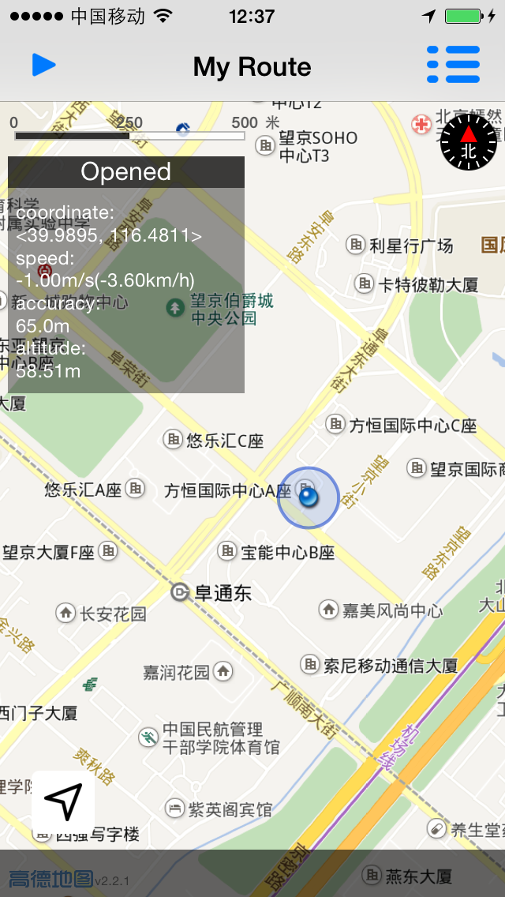
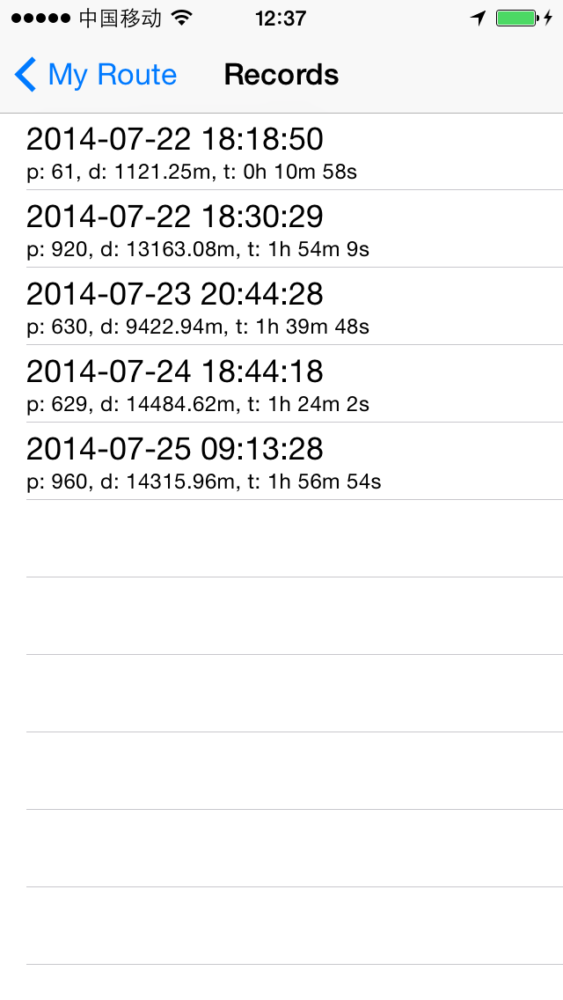
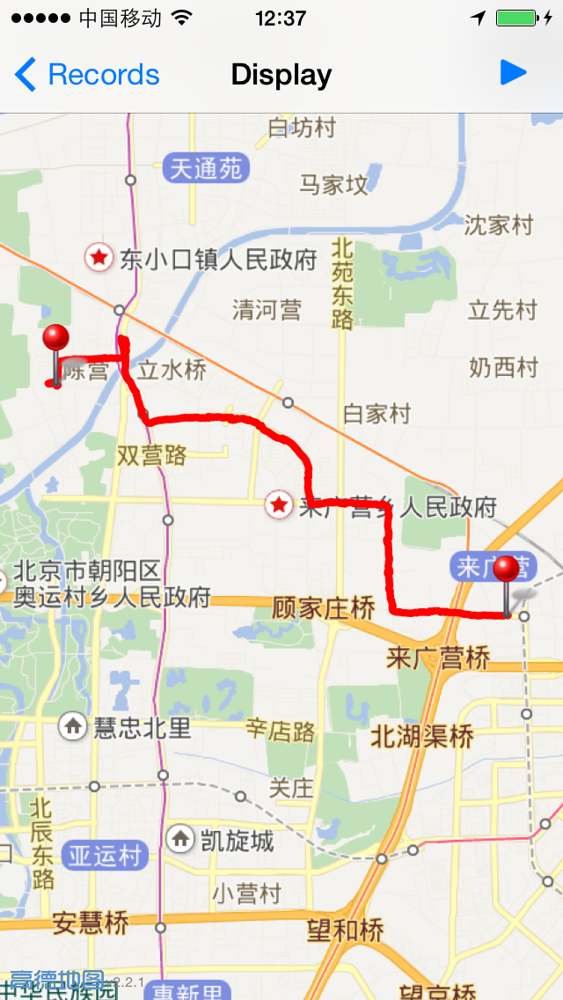

MyRoute
=======

### 前述

Use swift with MAMapKit.
此Demo使用swift语言，结合高德地图SDK，实现了记录路径、保存、查看路径等功能。

### 注意

此工程使用Xcode6 beta4 开发，请保证使用此版本打开工程。如果使用其他版本的XCode则不保证能够顺利编译通过。
另此工程使用的是高德MAMapKit的2D版本

### 使用说明

主界面左上按钮为开始/停止记录路径，右上按钮为查看历史记录。点击一条历史记录进入展示路径界面。

### 截图效果

